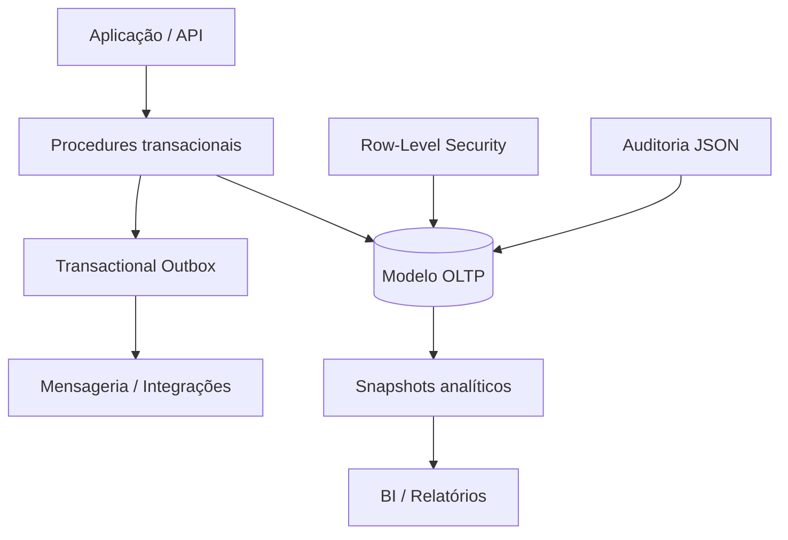

# SQL Commerce Platform — Enterprise Lab

Projeto técnico de portfólio em **SQL Server** que simula o núcleo transacional e analítico de uma plataforma SaaS de comércio multitenant.

## Escopo técnico

- modelagem relacional normalizada com integridade referencial;
- isolamento multitenant com Row-Level Security e `SESSION_CONTEXT`;
- ciclo de pedidos transacional com locks explícitos e controle de estoque;
- idempotência para proteção contra requisições duplicadas;
- padrão Transactional Outbox para integração assíncrona;
- trilha de auditoria imutável em JSON;
- histórico temporal de preços com system-versioned tables;
- roles e princípio do menor privilégio;
- índices compostos, filtrados e cobridores;
- analytics RFM, coortes, CLV, Pareto, classificação ABC e cobertura de estoque;
- snapshots incrementais para camada analítica;
- testes de integridade, isolamento, idempotência e compensação.

## Arquitetura



## Estrutura

| Arquivo | Responsabilidade |
|---|---|
| `sql/01_schema.sql` | Modelo OLTP, constraints e índices |
| `sql/02_seed.sql` | Dados simulados e reproduzíveis |
| `sql/03_analytics.sql` | Views e consultas analíticas |
| `sql/04_procedures.sql` | Operações transacionais básicas |
| `sql/05_enterprise_extensions.sql` | Multitenancy, temporal tables, auditoria, outbox e idempotência |
| `sql/06_order_lifecycle.sql` | Criação idempotente, cancelamento compensatório e consumo do outbox |
| `sql/07_enterprise_analytics.sql` | Coortes, CLV, ABC, cobertura e snapshots |
| `sql/08_security_and_audit.sql` | RLS, roles, permissões e trigger de auditoria |
| `tests/01_data_quality_tests.sql` | Integridade básica e regras de negócio |
| `tests/02_enterprise_tests.sql` | Idempotência, isolamento, eventos e ciclo de vida |

## Execução

Requer SQL Server 2019+ ou Azure SQL Database.

1. Crie um banco isolado para testes.
2. Execute `sql/01_schema.sql` até `sql/08_security_and_audit.sql`, nessa ordem.
3. Execute os arquivos de `tests/`.
4. Antes de consultar dados protegidos, execute:
   ```sql
   EXEC platform.usp_set_tenant_context @tenant_id = 1;
   ```

## Fluxo transacional relevante

A procedure `sales.usp_create_order_v2` valida o tenant, trava os produtos durante a reserva, impede estoque negativo, grava pedido e movimentação, registra a chave de idempotência e publica `OrderCreated` no outbox dentro da mesma transação. O cancelamento realiza compensação do estoque e publica `OrderCancelled`.

## Decisões de engenharia

- `decimal(19,4)` evita imprecisão monetária.
- `datetime2(7)` em UTC preserva precisão e padroniza integrações.
- `UPDLOCK + HOLDLOCK` evita overselling entre transações concorrentes.
- `READPAST` permite consumidores paralelos do outbox.
- JSON possui validação por `ISJSON`.
- RLS reduz o risco de vazamento entre clientes SaaS.
- Tabelas temporais preservam a evolução de preços.
- Testes transacionais usam rollback para não contaminar a massa base.

## Limites conscientes

Este laboratório não substitui testes de carga nem infraestrutura produtiva. Para produção ainda seriam necessários observabilidade, política de retenção, rotação/particionamento, backup, criptografia, CI e testes concorrentes executados por múltiplas sessões.

> Domínio e dados são simulados exclusivamente para demonstração técnica.
